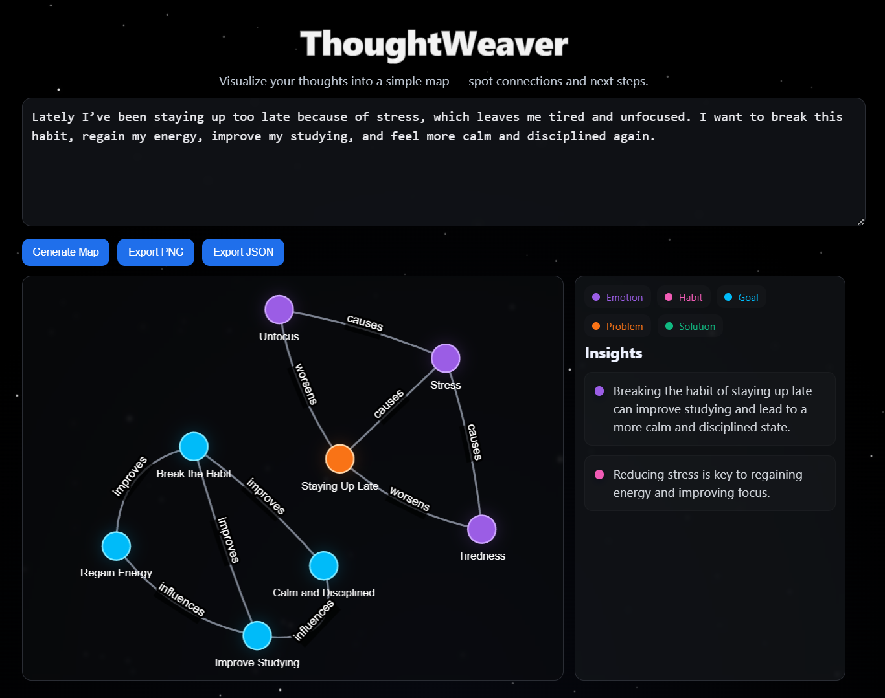

# ThoughtWeaver

Turn messy, unstructured thoughts into a clean, interactive mind map.

<p align="center">
  
</p>

ThoughtWeaver takes a block of free-form text, sends it to an AI backend, and returns a structured graph of concepts (nodes), relationships (edges), and short insights. The frontend renders this as an interactive network on top of a starfield background.

---

## ✨ Features

- **AI-powered graph generation**  
  Convert raw text into a JSON graph of nodes, edges, and human-readable insights.

- **Concept categories**  
  Nodes are labeled with categories such as `emotion`, `habit`, `goal`, `problem`, and `solution`, each with its own color and glow.

- **Interactive visualization**  
  - Hover to enlarge nodes  
  - Click a node to highlight its neighbors and connections  
  - View a short description of a node and what it’s connected to

- **Insights panel**  
  A compact sidebar displays AI-generated insights with accent colors that echo the node categories.

- **Export options**  
  - Export the current graph as a **PNG** image  
  - Export the underlying graph data as **JSON**

---

## 🧱 Tech Stack

**Backend**
- Python
- Flask
- Flask-CORS
- python-dotenv
- Groq or OpenAI (configurable via environment variables)
- gunicorn (for production deployment)

**Frontend**
- HTML5
- Vanilla JavaScript
- CSS (custom, with starfield background and animations)
- [vis-network](https://visjs.github.io/vis-network/) for interactive graph rendering

---

## 🗂 Project Structure
```text
THOUGHTWEAVER/
  backend/
    app.py
    requirements.txt
  frontend/
    index.html
    main.js
    style.css
  README.md
  .gitignore
